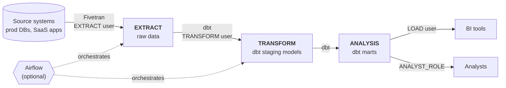

# Data Infrastructure Deployment

[](https://github.com/donovannevard/data-infrastructure-deployment/actions/workflows/ci.yml)

[](LICENSE)

Terraform that stands up a production-ready analytics platform for a new client
in a single `terraform apply`: a **Snowflake** or **Redshift** warehouse with
least-privilege RBAC and cost-optimized compute, **Fivetran** ingestion, and
optionally **Airflow** (AWS MWAA or self-hosted on EC2).

It encodes the setup I'd otherwise repeat by hand on every engagement, so a new
client gets a consistent, secure foundation for an ELT + dbt workflow in under
an hour instead of a day of console clicking.



## Highlights

- **One apply, any combination.** Pick a warehouse, toggle Fivetran and Airflow on
  or off. Nothing you didn't ask for is created: Snowflake + Fivetran never touches AWS.
- **Least-privilege RBAC.** A dedicated service user per stage (`EXTRACT`, `TRANSFORM`,
  `LOAD`) plus human `ANALYST` and `ADMIN` roles. Future grants mean new tables
  created by Fivetran or dbt are readable by the right roles automatically.
- **Cost-optimized compute.** Snowflake gets a separate warehouse per workload
  (X-Small for loading and BI, Medium for dbt), all auto-suspending after 60 seconds.
- **Secure by default.** Generated passwords only exposed as sensitive outputs, no
  `0.0.0.0/0` network defaults (rejected by validation), encrypted storage, private
  subnets, and an S3 DAG bucket with public access blocked.
- **Tested offline and live.** Every supported combination is exercised by
  `terraform test` against mocked providers in CI, and both warehouses have been
  deployed, verified and torn down against real Snowflake, AWS and Fivetran accounts.

## Try it in one minute (no accounts needed)

All you need is [Terraform](https://developer.hashicorp.com/terraform/install) 1.9+.

```bash
git clone https://github.com/donovannevard/data-infrastructure-deployment.git
cd data-infrastructure-deployment
make check
```

This checks formatting, validates both stacks, then runs the mocked test suite
for every warehouse / Fivetran / Airflow combination. No `make`? Run
`terraform -chdir=snowflake init -backend=false && terraform -chdir=snowflake test`
(and the same for `redshift`).

## Deploy it for real

### 1. Prerequisites

| You need | When |
|---|---|
| [Terraform](https://developer.hashicorp.com/terraform/install) 1.9+ | Always |
| Snowflake account + a user with `ACCOUNTADMIN` ([free trial](https://signup.snowflake.com/)) | Snowflake |
| AWS credentials in your shell (`aws configure` or `AWS_PROFILE`) | Redshift, or Airflow with either warehouse |
| Fivetran API key + secret ([free trial](https://fivetran.com/signup), then *Account Settings → API Config*) | `use_fivetran = true` (default) |

State is stored locally by default, so there is nothing else to set up.

### 2. Configure

Pick the folder that matches your warehouse and copy the example variables:

```bash
cd snowflake        # or: cd redshift
cp terraform.tfvars.example terraform.tfvars
```

Open `terraform.tfvars` and replace the `change-me` values. The example file
lists only what you need to set, with a comment on where to find each value;
everything else has a sensible default in `variables.tf`.

<details>
<summary>Snowflake key-pair auth (recommended; required if your account blocks password-only sign-in)</summary>

```bash
openssl genrsa 2048 | openssl pkcs8 -topk8 -nocrypt -out ~/.ssh/snowflake_terraform.p8
openssl rsa -in ~/.ssh/snowflake_terraform.p8 -pubout | grep -v "PUBLIC KEY" | tr -d '\n'
```

In a Snowflake worksheet, as `ACCOUNTADMIN`:

```sql
CREATE USER TERRAFORM TYPE = SERVICE DEFAULT_ROLE = ACCOUNTADMIN
  RSA_PUBLIC_KEY = '<output of the second command>';
GRANT ROLE ACCOUNTADMIN TO USER TERRAFORM;
```

Then set `snowflake_username = "TERRAFORM"` and
`snowflake_private_key_path = "~/.ssh/snowflake_terraform.p8"` (and remove
`snowflake_password`).
</details>

### 3. Deploy

```bash
terraform init
terraform apply
```

Review the plan and type `yes`. A Snowflake + Fivetran deploy takes a couple of
minutes. Redshift adds about 10 minutes, and MWAA 30–40 minutes to provision.

### 4. Get your credentials

```bash
terraform output -json snowflake            # or: redshift, redshift_connection
terraform output next_steps
```

Store these in a password manager. The local `terraform.tfstate` also contains
them in plaintext, so treat it as a secret too.

### 5. Tear down

```bash
terraform destroy
```

Redshift, MWAA and the NAT gateway bill by the hour, so destroy test deployments
when you're done. Redshift keeps a final snapshot on destroy as a safety net, and
destroy prints the command to delete it. For throwaway test deployments, set
`redshift_skip_final_snapshot = true` to skip it.

## Configuration

The main switches (full list with defaults in each stack's `variables.tf`):

| Variable | Description | Default |
|---|---|---|
| `use_fivetran` | Create a Fivetran group and register the warehouse as its destination | `true` |
| `use_airflow` | Deploy Airflow | `false` |
| `airflow_type` | `mwaa` (managed) or `ec2` (Docker Compose behind a load balancer) | `mwaa` |
| `redshift_allowed_cidrs` | CIDRs allowed to reach Redshift on 5439 *(redshift only)* | required |
| `redshift_publicly_accessible` | Public endpoint, still firewalled to the CIDRs above *(redshift only)* | `false` |
| `redshift_skip_final_snapshot` | Skip the safety-net snapshot on destroy (for test deployments) *(redshift only)* | `false` |
| `airflow_mwaa_webserver_access_mode` | `PUBLIC_ONLY` (UI behind AWS sign-in) or `PRIVATE_ONLY` (VPC only) | `PUBLIC_ONLY` |
| `ec2_inbound_cidr_restriction` | CIDR allowed to reach the EC2 Airflow UI | required for `ec2` |
| `airflow_ec2_enable_https` | Serve EC2 Airflow over HTTPS with an ACM certificate | `false` |

## Access model

What each identity can do in each layer (Snowflake roles / Redshift groups):

| Identity | Used by | EXTRACT | TRANSFORM | ANALYSIS |
|---|---|:-:|:-:|:-:|
| `EXTRACT` | Fivetran, Airflow extract jobs | write | | |
| `TRANSFORM` | dbt | read | write | write |
| `LOAD` | BI tools (Sigma, QuickSight, Looker…) | | | read |
| `ANALYST_ROLE` / `analyst_group` | Analysts | | | read |
| `ADMIN_ROLE` / `admin_group` | Senior analysts, admins | read | read | read |

**Snowflake** creates `EXTRACT`, `TRANSFORM` and `ANALYSIS` databases (each with a
schema of the same name) and warehouses `EXTRACT_WH` (X-Small), `TRANSFORM_WH`
(Medium) and `ANALYSIS_WH` (X-Small). **Redshift** uses one database with
`extract`, `transform` and `analysis` schemas, and assigns group membership natively.

Human users are created by hand and given a role:

```sql
-- Snowflake
CREATE USER jsmith PASSWORD = '...' MUST_CHANGE_PASSWORD = TRUE
  DEFAULT_ROLE = ANALYST_ROLE DEFAULT_WAREHOUSE = ANALYSIS_WH;
GRANT ROLE ANALYST_ROLE TO USER jsmith;

-- Redshift
CREATE USER jdoe PASSWORD '...';
ALTER GROUP analyst_group ADD USER jdoe;
```

## Design decisions

- **Two stacks instead of a `warehouse_type` switch.** The Snowflake provider
  authenticates as soon as it is configured, even if no Snowflake resources are
  planned. One combined stack would force every Redshift client to have working
  Snowflake credentials. [`snowflake/`](snowflake/) and [`redshift/`](redshift/)
  stay independent while sharing everything in [`modules/`](modules/).
- **Local state by default.** It needs no setup before a first apply. For team use,
  swap `backend "local" {}` in `main.tf` for S3 or Terraform Cloud, or declare an
  empty `backend "s3" {}` and pass `-backend-config` flags at `terraform init`.
- **Fivetran never uses admin credentials.** The destination authenticates as the
  `EXTRACT` service user, which can only write to the raw layer.
- **Redshift is private unless you opt in.** Terraform manages users and grants by
  connecting to the cluster, so it must be reachable from where you run it. Either
  set `redshift_publicly_accessible = true` (still limited to your allowed CIDRs, and
  needed for Fivetran without an SSH tunnel or PrivateLink), or run Terraform from
  inside the VPC.

## Repository layout

```
.
├── snowflake/              Snowflake stack (entry point)
│   └── tests/              mocked tests for each combination
├── redshift/               Redshift stack (entry point)
│   └── tests/
├── modules/                shared by both stacks
│   ├── snowflake/          warehouses, databases, roles, users, grants
│   ├── redshift/           schemas, users, groups, grants
│   ├── aws/                VPC, Redshift cluster, S3 DAG bucket
│   ├── fivetran/           group + destination
│   ├── airflow_mwaa/       managed Airflow
│   └── airflow_ec2/        self-hosted Airflow (Docker Compose + ALB)
├── tests/mocks/            shared mock data for terraform test
├── docs/testing.md         live verification checklist
└── Makefile                make check = fmt + validate + test
```

## Testing

- **Offline** (`make check`, runs in CI): format check, `terraform validate`, and
  `terraform test` with mocked providers covering every warehouse × Fivetran ×
  Airflow combination, plus the input validations (e.g. `0.0.0.0/0` is rejected).
- **Live**: Snowflake + Fivetran + Airflow (EC2) and Redshift + Fivetran + Airflow
  (MWAA) have been applied, verified and destroyed cleanly against real accounts,
  which together exercise every module. [`docs/testing.md`](docs/testing.md)
  is the checklist for repeating that.

## Security notes

- Service user passwords are randomly generated and only exposed as sensitive outputs.
  Rotate one with `terraform apply -replace=<random_password resource address>`.
- Network access is never open by default: the Redshift and EC2 Airflow CIDRs have
  no default, and `0.0.0.0/0` is rejected for Redshift.
- `terraform.tfvars` and `*.tfstate` are gitignored; both contain secrets once used.

## License

[MIT](LICENSE)
